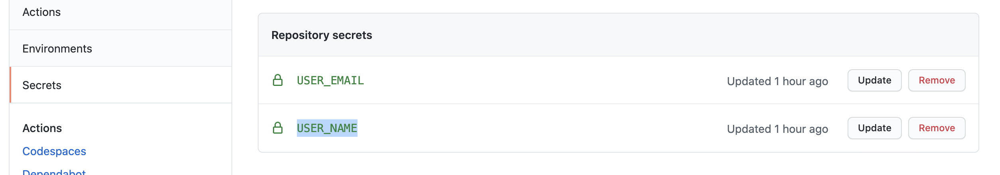
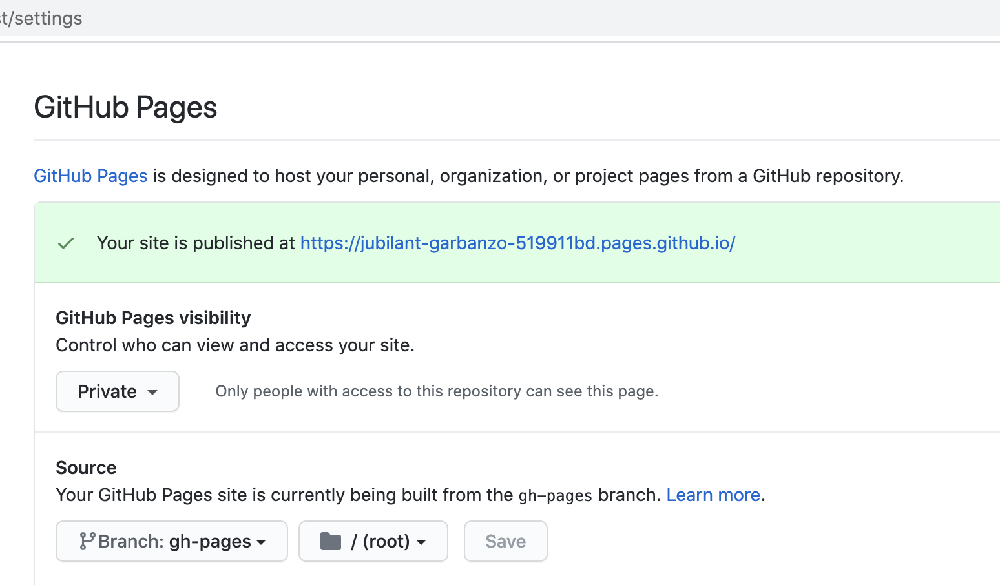

# Honkit(forked gitbook ver1) GitHub Pages publishing by GitHub Actions

## Instruction

1. Write gitbook markdown documents and save them to a document GitHub repository.
2. Setup 2 secrets in Secrets of the repository.
   1. USER_NAME -> GitHub username
   2. USER_EMAIL -> GitHub user email
   
3. Setup GitHub actions in the repository with this Actions.

    ```markdown
    name: Flow-CI-Honkit

    on:
      push:
        branches:
            - main # pls change trigger on each repos
    env:
      USER_EMAIL: ${{secrets.USER_EMAIL}}
      USER_NAME: ${{secrets.USER_NAME}}
      GITHUB_TOKEN: ${{ secrets.GITHUB_TOKEN }}

    jobs:
      Build-Deploy:
        runs-on: ubuntu-latest
        steps:
          - name: Build and deploy
            uses: monstar-lab-oss/honkit-ghpages-action@main
    ```

4. Setup GitHub Pages of the repo.
   1. Choose visibility. Private is recommended(Only people with access to this repository can see this page.).
   2. Choose Source branch to gh-pages
   
5. Push the gitbook docs to the repo, it triggers this Actions and update GitHub pages.